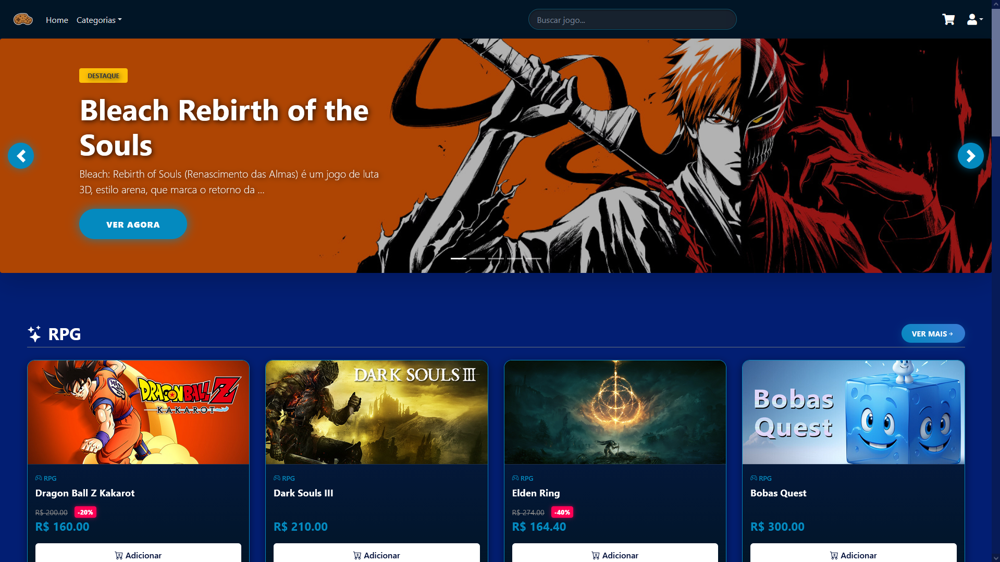

# 🎮 CoolKeys

**CoolKeys — Plataforma de e-commerce de jogos digitais**

CoolKeys é um projeto de **e-commerce de jogos** desenvolvido como **projeto final em grupo** do curso **Python Web Development Fullstacker**, realizado no **SENAC**.

O objetivo do projeto foi aplicar, na prática, conceitos de **backend, frontend, autenticação, permissões e organização de um sistema web completo**.

* 🔧 **Backend:** desenvolvido por **IanSeedd**
* 🎨 **Frontend:** desenvolvido pelos colaboradores **Dudss2007**, **leonardohishinuma** e **mesquitainfa93**

---

## 📁 Índice

* 🔧 Requisitos
* 🚀 Instalação e configuração

  * 1. Clonar o repositório
  * 2. Criar ambiente virtual (venv)
  * 3. Instalar dependências
  * 4. Criar superuser
  * 5. Tornar usuário `admin_staff` via `/admin`
  * 6. Rodar o servidor
* 🧠 Uso do sistema
* ❤️ Créditos
* 📜 Contexto acadêmico

---

## 🔧 Requisitos

Antes de começar, você precisa ter instalado:

* Git

---

## 🚀 Instalação e Configuração

### 1️⃣ Clonar o repositório

```bash
git clone https://github.com/IanSeedd/CoolKeys.git
cd CoolKeys
```

---

### 2️⃣ Criar e ativar o ambiente virtual (venv)

#### Linux / macOS

```bash
python3 -m venv venv
source venv/bin/activate
```

#### Windows (PowerShell)

```powershell
python -m venv venv
venv\Scripts\Activate.ps1
```

📌 Ao ativar corretamente, o terminal exibirá `(venv)` antes do caminho.

---

### 3️⃣ Instalar dependências

Com o ambiente virtual ativo:

```bash
pip install -r requirements.txt
```

---

### 4️⃣ Criar o superuser (obrigatório)

O superuser será necessário para **acessar o Django Admin** e configurar permissões de usuários.

```bash
python manage.py createsuperuser
```

Informe:

* Nome de usuário
* Email
* Senha

⚠️ **Esse usuário ainda NÃO tem acesso automático ao dashboard nativo do CoolKeys.**
Ele será usado para conceder permissões corretamente no próximo passo.

---

### 5️⃣ Acessar `/admin` e conceder permissão `admin_staff` (PASSO CRÍTICO)

Agora inicie o servidor:

```bash
python manage.py runserver
```

Acesse no navegador:

```
http://127.0.0.1:8000/admin
```

Faça login com o **superuser criado anteriormente**.

#### Dentro do painel admin:

1. Vá até **Usuários (Users)**
2. Selecione o usuário desejado
3. Ative a flag ou campo:

   * `admin_staff` (ou equivalente no modelo do projeto)
4. Salve as alterações

✅ **Somente usuários com `admin_staff = True` conseguem acessar o dashboard administrativo nativo do CoolKeys.**

Esse passo é **obrigatório** para que o sistema reconheça o usuário como administrador do painel interno, e não apenas como superuser do Django.

---

### 6️⃣ Acessar o sistema

* Site principal:

  ```
  http://127.0.0.1:8000
  ```

* Dashboard administrativo do CoolKeys:

  ```
  http://127.0.0.1:8000/dashboard
  ```

  (ou a rota definida no projeto)

---

## 🧠 Uso do Sistema

* O backend gerencia:

  * Usuários e permissões
  * Autenticação
  * Lógica administrativa
* O frontend consome as rotas e APIs fornecidas pelo backend
* O dashboard do CoolKeys **não é o Django Admin**, mas depende dele para conceder permissões iniciais

---

## ❤️ Créditos

Projeto desenvolvido em grupo por:

| Função   | Nome                  | GitHub                                                                       |
| -------- | --------------------- | ---------------------------------------------------------------------------- |
| Backend  | **IanSeedd**          | [https://github.com/IanSeedd](https://github.com/IanSeedd)                   |
| Frontend | **leonardohishinuma** | [https://github.com/leonardohishinuma](https://github.com/leonardohishinuma) |
| Frontend | **Dudss2007**         | [https://github.com/Dudss2007](https://github.com/Dudss2007)                 |
| Frontend | **mesquitainfa93**    | [https://github.com/Dudss2007](https://github.com/mesquitainfa93)            |

---

## 📜 Contexto Acadêmico

Este projeto foi desenvolvido como **trabalho final do curso Python Web Development Fullstacker do SENAC**, com foco em:

* Desenvolvimento backend em Python
* Integração frontend/backend
* Controle de permissões
* Estruturação de um projeto web real

---


